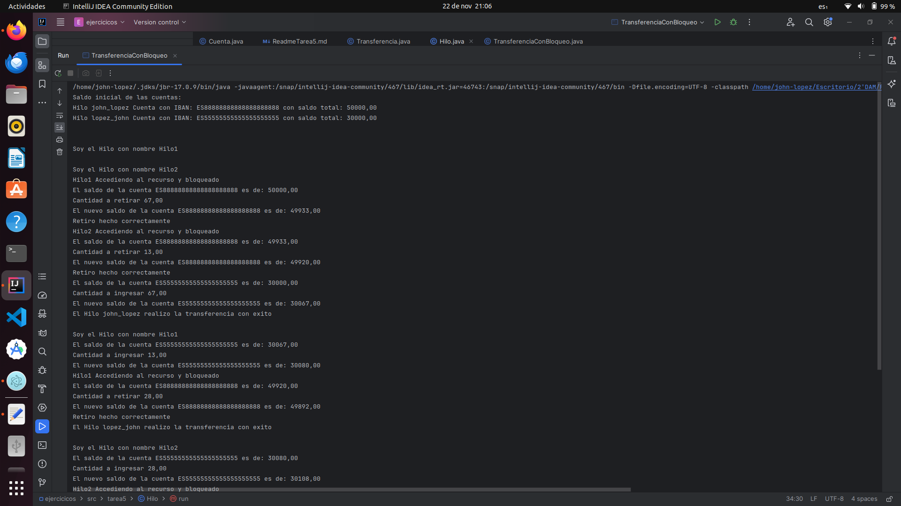
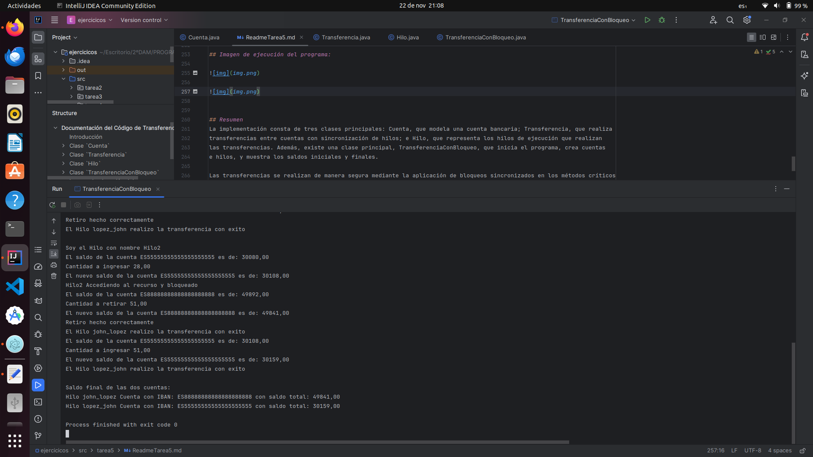

# Documentación del Código de Transferencia Bancaria

## Introducción
El código presenta una implementación de transferencia bancaria entre dos cuentas simuladas mediante hilos de ejecución
en Java. La solución aborda la necesidad de realizar transferencias concurrentes de manera segura, utilizando bloqueos
intrínsecos para evitar problemas de concurrencia en la manipulación de saldos. Se han creado clases específicas para
representar cuentas, realizar transferencias y gestionar hilos, proporcionando una estructura organizada y modular.

## Clase `Cuenta`

La clase `Cuenta` representa una cuenta bancaria con un número de cuenta (IBAN) y un saldo.

### Métodos

- `Cuenta(String iban, double saldo)`: Constructor de la clase.
- `double getSaldo()`: Devuelve el saldo actual de la cuenta (método sincronizado).
- `void ingresaCantidad(double cantidad)`: Ingresa una cantidad en la cuenta (método sincronizado).
- `void sacarCantidad(double cantidad)`: Saca una cantidad de la cuenta (método sincronizado).
- `String getNumeroCuenta()`: Devuelve el número de cuenta (IBAN) de la cuenta (método sincronizado).
- `String toString()`: Devuelve una representación en cadena de la cuenta.

```java
public class Cuenta {
    private String iban;
    private double saldo;


    public Cuenta(String iban, double saldo) {
        this.iban = iban;
        this.saldo = saldo;
    }

    public synchronized double getSaldo() {
        return saldo;
    }

    public synchronized void ingresaCantidad(double cantidad) {
        saldo += cantidad;
    }

    public synchronized void sacarCantidad(double cantidad) {
        saldo -= cantidad;
    }

    public synchronized String getNumeroCuenta() {
        return iban;
    }

    /**
     * Clase Transferencia: Representa una transferencia entre dos cuentas bancarias.
     */
    @Override
    public String toString() {
        return String.format("Cuenta con IBAN: %S con saldo total: %.2f",iban,saldo);
    }
}
```

## Clase `Transferencia`

La clase `Transferencia` realiza transferencias entre dos cuentas bancarias.

### Métodos

- `Transferencia(Cuenta c1, Cuenta c2)`: Constructor de la clase.
- `static boolean transferencia(Cuenta c1, Cuenta c2, double cantidad)`: Realiza una transferencia entre dos cuentas
  (método sincronizado).

### Métodos Auxiliares

- `static boolean retirarDinero(double cantidad)`: Retira dinero de la cuenta de origen (método sincronizado).
- `static boolean depositarDinero(double cantidad)`: Deposita dinero en la cuenta de destino (método sincronizado).


```java
    /**
    * Clase Transferencia: Representa una transferencia entre dos cuentas bancarias.
    */
    public class Transferencia {
    private static  Cuenta cuenta1;
    private static  Cuenta cuenta2;


    /**
     * Método estático sincronizado que realiza una transferencia entre dos cuentas.
     * @param c1 Cuenta de origen.
     * @param c2 Cuenta de destino.
     * @param cantidad Cantidad a transferir.
     * @return true si la transferencia se realiza con éxito, false si no es posible.
     */
    public static boolean transferencia(Cuenta c1, Cuenta c2, double cantidad) {

        System.out.printf("\nSoy el Hilo con nombre %s%n",
                Thread.currentThread().getName());
        // Establecer un orden fijo para adquirir los bloqueos
        if (c1.getSaldo() >= c2.getSaldo()) {
            cuenta1 = c1;
            cuenta2 = c2;
            System.out.println(retirarDinero(cantidad) ?
                    "Retiro hecho correctamente" : "Fallo retiro");
            return depositarDinero(cantidad);
        } else {
            cuenta1 = c2;
            cuenta2 = c1;
            System.out.println(retirarDinero(cantidad) ?
                    "Retiro hecho correctamente" : "Fallo retiro");
            return depositarDinero(cantidad);
        }

    }

    /**
     * Método estático sincronizado que retira dinero de la cuenta de origen.
     * @param cantidad Cantidad a retirar.
     * @return true si el retiro se realiza con éxito, false si no es posible.
     */
    public static synchronized boolean retirarDinero(double cantidad){
        System.out.printf("%s Accediendo al recurso y bloqueado%n",
                Thread.currentThread().getName());
        if( cuenta1.getSaldo() >= cantidad){
            System.out.printf("El saldo de la cuenta %s es de: %.2f%n",
                    cuenta1.getNumeroCuenta(),cuenta1.getSaldo());
            cuenta1.sacarCantidad(cantidad);
            System.out.printf("Cantidad a retirar %.2f%n",cantidad);
            System.out.printf("El nuevo saldo de la cuenta %s es de: %.2f%n",
                    cuenta1.getNumeroCuenta(),cuenta1.getSaldo());
            return true;
        }else{
            System.out.println("saldo insuficiente al intentar retirar " + cantidad);
            return false;
        }
    }

    /**
     * Método estático sincronizado que deposita dinero en la cuenta de destino.
     * @param cantidad Cantidad a depositar.
     * @return true si el depósito se realiza con éxito, false si no es posible.
     */
    public static synchronized  boolean depositarDinero(double cantidad){
        try {
            Thread.sleep(20);
        } catch (InterruptedException e) {
            System.out.println(e.getMessage());
        }
        System.out.printf("El saldo de la cuenta %s es de: %.2f%n",
                cuenta2.getNumeroCuenta(),cuenta2.getSaldo());
        cuenta2.ingresaCantidad(cantidad);
        System.out.printf("Cantidad a ingresar %.2f%n",cantidad);
        System.out.printf("El nuevo saldo de la cuenta %s es de: %.2f%n",
                cuenta2.getNumeroCuenta(),cuenta2.getSaldo());
        return true;
    }

}
```

## Clase `Hilo`

La clase `Hilo` representa un hilo de ejecución que realiza transferencias entre dos cuentas.

### Métodos

- `Hilo(String nombre, Cuenta c1, Cuenta c2)`: Constructor de la clase.
- `String getNombre()`: Devuelve el nombre del hilo.
- `void run()`: Ejecuta las transferencias entre las cuentas.

```java
/**
 * Clase Hilo: Representa un hilo de ejecución que realiza transferencias
 * entre dos cuentas.
 */
public class Hilo extends Thread {
    private String nombre;
    private Cuenta c1;
    private Cuenta c2;

    public Hilo(String nombre,Cuenta c1,Cuenta c2) {
        this.nombre = nombre;
        this.c1     = c1;
        this.c2     = c2;
    }

    /**
     * Método que devuelve el nombre del hilo.
     * @return Nombre del hilo.
     */
    public String getNombre() {
        return nombre;
    }

    /**
     * Método run que ejecuta las transferencias entre las cuentas.
     */
    @Override
    public void run() {

        for (int i = 0; i < 10; i++) {
            boolean resultado = Transferencia.transferencia(c1,c2, new Random().nextInt(100));
            System.out.println((resultado)?"El Hilo " + nombre + " realizo la transferencia con exito" :
                    "No se ha realizado la transferencia");

        }
    }
}
```

## Clase `TransferenciaConBloqueo`

Programa principal que simula transferencias entre dos cuentas con bloqueo.

### Método Principal

- `main(String[] args)`: Inicia el programa creando cuentas y hilos, mostrando saldos iniciales y finales.

```java
/**
 * Clase TransferenciaConBloqueo: Programa principal que simula
 * transferencias entre dos cuentas con bloqueo.
 */
public class TransferenciaConBloqueo {
    public static void main(String[] args) {

        Cuenta c1 = new Cuenta("ES88888888888888888888", 50000.0);
        Cuenta c2 = new Cuenta("ES55555555555555555555", 30000.0);

        Hilo h1 = new Hilo("john_lopez",c1,c2);
        Hilo h2 = new Hilo("lopez_john",c1,c2);
        h1.setName("Hilo1");
        h2.setName("Hilo2");

        System.out.println("Saldo inicial de las cuentas: ");
        System.out.printf("Hilo %s %s%n",h1.getNombre(),c1);
        System.out.printf("Hilo %s %s%n%n",h2.getNombre(),c2);

        h1.start();
        h2.start();

        try {
            h1.join();
            h2.join();
        } catch (InterruptedException e) {
            System.out.println(e.getMessage());
        }

        System.out.println("\nSaldo final de las dos cuentas:");
        System.out.printf("Hilo %s %s%n",h1.getNombre(),c1);
        System.out.printf("Hilo %s %s%n",h2.getNombre(),c2);
    }
}
```

## Imagen de ejecución del programa:






## Resumen
La implementación consta de tres clases principales: Cuenta, que modela una cuenta bancaria; Transferencia, que realiza
transferencias entre cuentas con sincronización de hilos; e Hilo, que representa los hilos de ejecución que realizan
las transferencias. Además, existe una clase principal, TransferenciaConBloqueo, que inicia el programa, crea cuentas
e hilos, y muestra los saldos iniciales y finales.

Las transferencias se realizan de manera segura mediante la aplicación de bloqueos sincronizados en los métodos críticos
, garantizando la integridad de los saldos y evitando condiciones de carrera.}


## Conclusiones
La implementación proporciona una solución efectiva y segura para realizar transferencias bancarias concurrentes en un
entorno multihilo. El uso de bloqueos intrínsecos asegura que la manipulación de datos compartidos sea coherente y
evita problemas de concurrencia.

El código es fácilmente adaptable y extensible, permitiendo la incorporación de nuevas funcionalidades o la integración
en sistemas más complejos. La estructura modular facilita la comprensión y mantenimiento del código.

Se ha demostrado la importancia de la sincronización en entornos multihilo para evitar interbloqueos y condiciones de
carrera. La aplicación de buenas prácticas de concurrencia contribuye a la robustez y confiabilidad del programa.


[REPOSITORIO:https://github.com/johnlopez0505/ejercicios.git](https://github.com/johnlopez0505/ejercicios.git)
