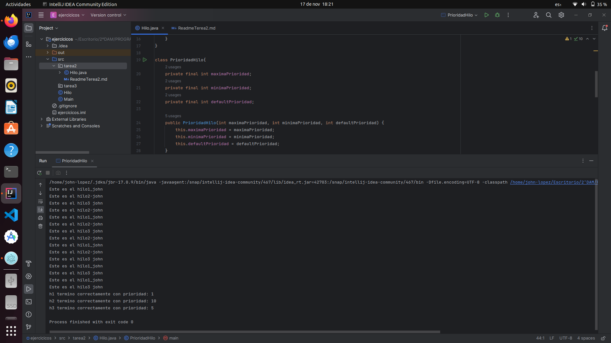

## Prioridades de Hilos en Java - Clase Thread

### Introducción
En Java, la clase Thread se utiliza para crear y manipular hilos. Un hilo representa una secuencia independiente de 
ejecución dentro de un programa. Cada hilo tiene asociada una prioridad, que es un valor entero que determina la 
importancia relativa del hilo para el programador o el sistema operativo.

### Valores de Prioridad
La clase Thread proporciona constantes estáticas para representar los valores de prioridad mínima y máxima:

- `Thread.MIN_PRIORITY` - Representa la prioridad mínima de un hilo (valor: 1).
- `Thread.NORM_PRIORITY` - Representa la prioridad normal predeterminada de un hilo (valor: 5).
- `Thread.MAX_PRIORITY` - Representa la prioridad máxima de un hilo (valor: 10).

### Establecer y Obtener Prioridades
La prioridad de un hilo se puede establecer mediante el método `setPriority(int newPriority)` de la clase **Thread**. El 
parámetro newPriority debe ser un valor entre `Thread.MIN_PRIORITY` y `Thread.MAX_PRIORITY`.

```java
Thread ejemploHilo = new Thread(() -> {
    // Código del hilo
});

// Establecer la prioridad del hilo
ejemploHilo.setPriority(Thread.MAX_PRIORITY);

```

Para obtener la prioridad de un hilo, se utiliza el método getPriority():

```java
int prioridad = ejemploHilo.getPriority();
System.out.println("Prioridad del hilo de ejemplo: " + prioridad);

```

**Ejemplo de Programa**:

A continuación, se presenta un ejemplo de programa que muestra la información sobre prioridades de hilos:

```java
public class Hilo implements Runnable {
    private String nombre;

    public Hilo(String nombre) {
        this.nombre = nombre;
    }

    @Override
    public void run() {

        for (int i = 0; i < 5; i++) {
            System.out.println("Este es el " + this.nombre);
        }
    }
}

class PrioridadHilo{
    private final int maximaPrioridad;
    private final int minimaPrioridad;
    private final int defaultPrioridad;

    public PrioridadHilo(int maximaPrioridad, int minimaPrioridad, int defaultPrioridad) {
        this.maximaPrioridad = maximaPrioridad;
        this.minimaPrioridad = minimaPrioridad;
        this.defaultPrioridad = defaultPrioridad;
    }

    public static void main(String[] args) {
        PrioridadHilo p = new PrioridadHilo(Thread.MAX_PRIORITY,Thread.MIN_PRIORITY,Thread.NORM_PRIORITY);

        Thread h1 = new Thread(new Hilo("hilo1_john"));
        Thread h2 = new Thread(new Hilo("hilo2-john"));
        Thread h3 = new Thread(new Hilo("hilo3 john"));

        h1.start();
        h2.start();
        h3.start();

        h1.setPriority(p.minimaPrioridad);
        h2.setPriority(p.maximaPrioridad);
        h3.setPriority(p.defaultPrioridad);

        try {
            h1.join();
            System.out.println("h1 termino correctamente con prioridad: " + h1.getPriority());
            h2.join();
            System.out.println("h2 termino correctamente con prioridad: " + h2.getPriority());
            h3.join(1,569);
            System.out.println("h3 termino correctamente con prioridad: " + h3.getPriority());

        } catch (InterruptedException e) {
            System.out.println("El hilo ha sido interrumpido");
        }
    }
}
```

Este programa muestra la prioridad mínima y máxima de un hilo, así como la prioridad predeterminada de un hilo.

`Conclusión`:
El manejo de prioridades de hilos es útil en situaciones donde se necesita controlar la ejecución de los hilos en 
función de su importancia relativa en el programa. Sin embargo, es importante utilizar este mecanismo con cuidado, ya 
que depender demasiado de las prioridades puede llevar a problemas de rendimiento y sincronización en la aplicación.

___

Imagen de ejecucion:

