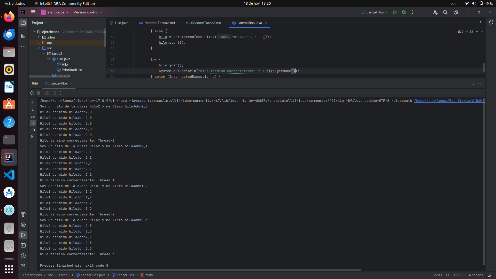

# Tarea3


- Modificar el Ejemplo de cómo el padre se espera a que acaben sus hijos, pero debéis hacer dos clases Hillo1 e Hilo2 que 
se diferencien en el primer  mensaje de salida del tipo "Soy un hilo de la clase Hilo1 y me llamo X", o "Soy un hilo de 
la clase Hilo2 y me lamo Y".

- El método main, deberá crear 4 hilos pero con una variable boolean  aleatoria, decidirá lanzar un hilo de la clase Hilo1
si es true y de la clase Hilo2, si es false. Al final serán 4 hilos pero de manera aleatoria serán del tipo Hilo1 o 
Hilo2.

## `Manejo de Hilos en Java - Clase Thread`

### Introducción

En Java, la manipulación de hilos se realiza mediante la clase Thread, que permite la creación y control de secuencias 
de ejecución independientes dentro de un programa. Cada hilo tiene asociada una prioridad que determina su importancia 
relativa en la ejecución.

Ejemplo Práctico

A continuación, se presentan dos clases, Hilo1 y Hilo2, que implementan la interfaz Runnable. Estas clases representan 
hilos con diferentes comportamientos y patrones de sueño.

```java
class Hilo1 implements Runnable {
    private String nombre;

    public Hilo1(String nombre) {
        this.nombre = nombre;
    }

    @Override
    public void run() {
        System.out.println("Soy un hilo de la clase Hilo1 y me llamo " + this.nombre);
        for (int i = 0; i < 4; i++) {
            int pausa = 10 + new Random().nextInt(500 - 10);
            try {
                Thread.sleep(pausa);
                System.out.println("Hilo1 dormido " + this.nombre);
            } catch (InterruptedException e) {
                System.out.println("El hilo ha sido interrumpido");
            }
        }
    }
}

class Hilo2 implements Runnable {
    private String nombre;

    public Hilo2(String nombre) {
        this.nombre = nombre;
    }

    @Override
    public void run() {
        System.out.println("Soy un hilo de la clase Hilo2 y me llamo " + this.nombre);
        for (int i = 0; i < 5; i++) {
            int pausa = 10 + new Random().nextInt(500 - 10);
            try {
                Thread.sleep(pausa);
                System.out.println("Hilo2 dormido " + this.nombre);
            } catch (InterruptedException e) {
                System.out.println("El hilo ha sido interrumpido");
            }
        }
    }
}

public class LanzaHilos {
    public static void main(String[] args) {
        Thread hilo;
        for (int i = 0; i < 4; i++) {
            boolean aleatorio = new Random().nextBoolean();
            if (aleatorio) {
                hilo = new Thread(new Hilo1("HiloJohn1_" + i));
                hilo.start();
            } else {
                hilo = new Thread(new Hilo2("hiloJohn2_" + i));
                hilo.start();
            }

            try {
                hilo.join();
                System.out.println("Hilo terminó correctamente: " + hilo);
            } catch (InterruptedException e) {
                System.out.println("El hilo ha sido interrumpido");
            }
        }
    }
}

```
___

### Creación y Ejecución de Hilos

En la clase LanzaHilos, se muestra la creación y ejecución de instancias de Hilo1 y Hilo2. Los hilos son lanzados de 
manera aleatoria con una variable boleana, cada uno con su propio nombre y patrón de sueño.

### Detalles de Ejecución

Ambas clases Hilo1 y Hilo2 realizan operaciones dentro del método run(). Además, los hilos incluyen pausas aleatorias }
utilizando Thread.sleep(), simulando situaciones donde un hilo puede estar inactivo por un período.


