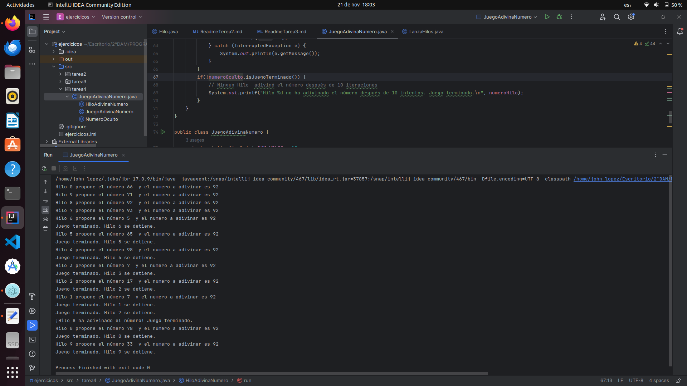

# Tarea 4 Adivina el número aleatorio

- Un hilo debe generar un número al azar entre cero y cien, que deben intentar adivinar otros diez hilos. Si un hilo 
acierta el número, debe terminar su ejecución inmediatamente. Y el resto de los hilos deben también terminar su 
ejecución en cuanto propongan un número y se les avise de que otro hilo ya ha acertado el número.

- Se propone utilizar una clase NumeroOculto con un método int propuestaNumero(int num) que devuelva los siguientes 
valores:
  - -1 si el juego ya ha terminado porque un hilo ha adivinado el número.
  - 1 si el número propuesto (num) es el número oculto.
  - 0 en otro caso.

- No es necesario que se cree una clase para el hilo que genera el número aleatorio, porque será el que ejecute el mismo
main.

## 1. Introducción:
El código implementa un juego donde un hilo principal genera un número aleatorio entre 0 y 100, y otros diez hilos 
intentan adivinar ese número. El juego termina tan pronto como un hilo adivina el número o todos los hilos completan 
sus 10 intentos.

## 2. Clase `NumeroOculto`:
Esta clase representa el número oculto que los hilos intentarán adivinar. Al ser instanciada, genera un número aleatorio
entre 0 y 100. Contiene tres métodos:

- `getNumeroOculto()`: Retorna el número oculto.
- `isJuegoTerminado()`: Retorna un booleano indicando si el juego ha terminado.
- `propuestaNumero(int num)`: Método sincronizado que evalúa la propuesta de un número. Retorna -1 si el juego ya 
   terminó, 1 si el número fue adivinado correctamente, y 0 si la propuesta es incorrecta.

```java
class NumeroOculto {
    private int numeroOculto;
    private boolean juegoTerminado;

    public NumeroOculto() {
        Random rand = new Random();
        this.numeroOculto = rand.nextInt(101);
        this.juegoTerminado = false;
    }

    public int getNumeroOculto() {
        return numeroOculto;
    }

    public boolean isJuegoTerminado() {
        return juegoTerminado;
    }

    public synchronized int propuestaNumero(int num) {
        if (juegoTerminado) {
            return -1; // Juego terminado porque un hilo ya ha adivinado el número
        } else if (num == numeroOculto) {
            juegoTerminado = true;
            return 1; // Número adivinado correctamente
        } else {
            return 0; // Número incorrecto, el juego continúa
        }
    }
}
```
---

## 3. Clase `HiloAdivinaNumero`:
Esta clase representa un hilo que intenta adivinar el número oculto. Cada hilo tiene un límite de 10 intentos. Contiene 
dos atributos:

- `numeroHilo`: Identificador único del hilo.
- `numeroOculto`: Instancia de `NumeroOculto` compartida entre los hilos.

El método `run()` contiene la lógica principal del hilo:

- Se ejecuta un bucle `for` con 10 iteraciones representando los intentos del hilo.
- En cada iteración, se genera un número aleatorio (`numeroPropuesto`) y se imprime junto con el número oculto para 
  fines de depuración.
- La propuesta se evalúa utilizando el método `propuestaNumero` de la instancia `NumeroOculto`.
- Si el número es adivinado, el hilo imprime un mensaje y termina. Si el juego ya terminó, el hilo también termina.
- Se espera un breve periodo de tiempo antes de la siguiente propuesta.
- Si después de 10 intentos el número no es adivinado, el hilo imprime un mensaje indicando que el juego terminó para 
  ese hilo.

```java
class HiloAdivinaNumero extends Thread {
    private int numeroHilo;
    private NumeroOculto numeroOculto;

    HiloAdivinaNumero(int numeroHilo, NumeroOculto numeroOculto) {
        this.numeroHilo = numeroHilo;
        this.numeroOculto = numeroOculto;
    }

    public void run() {
        int intentos = 10;
        for (int i = 0; i < intentos; i++) { // Utiliza un bucle for con 10 iteraciones
            int numeroPropuesto = new Random().nextInt(101); // Número aleatorio entre 0 y 100
            System.out.printf("Hilo %d propone el número %d  y el numero a adivinar es %d\n", numeroHilo,
                    numeroPropuesto,numeroOculto.getNumeroOculto());

            int resultado = numeroOculto.propuestaNumero(numeroPropuesto);

            if (resultado == 1) {
                System.out.printf("¡Hilo %d ha adivinado el número! Juego terminado.\n", numeroHilo);
                break;
            } else if (resultado == -1) {
                System.out.printf("Juego terminado. Hilo %d se detiene.\n", numeroHilo);
                break;
            }

            // Espera un momento antes de realizar la siguiente propuesta
            try {
                Thread.sleep(100);
            } catch (InterruptedException e) {
                System.out.println(e.getMessage());
            }
        }
        if(!numeroOculto.isJuegoTerminado()) {
            // Ningun Hilo  adivinó el número después de 10 iteraciones
            System.out.printf("Hilo %d no ha adivinado el número después de %d intentos. Juego terminado.\n",
                    numeroHilo,intentos);
        }
    }
}
```

## 4. Clase `JuegoAdivinaNumero`:
El método `main` inicia el juego. Se crea una instancia de `NumeroOculto` y un array de `HiloAdivinaNumero`. Se inician
y se espera la finalización de los hilos.

```java
public class JuegoAdivinaNumero {
    private static final int NUM_HILOS = 10;

    public static void main(String[] args) {
        NumeroOculto numeroOculto = new NumeroOculto();
        HiloAdivinaNumero hilos[] = new HiloAdivinaNumero[NUM_HILOS];

        for (int i = 0; i < NUM_HILOS; i++) {
            hilos[i] = new HiloAdivinaNumero(i, numeroOculto);
            hilos[i].start();
        }

        for (int i=0; i<NUM_HILOS; i++){
            try{
                hilos[i].join();
            }catch(InterruptedException e){
                System.out.println ("Se ha producido una interrupción no deseado\n");
            }
        }

    }
}
```
___

## 5. Consideraciones Adicionales:

- El código utiliza el método `sleep` para introducir una pequeña pausa entre las propuestas de los hilos.
- El uso de métodos sincronizados y el concepto de bloqueo garantizan un acceso seguro a los datos compartidos.

## 6. Conclusiones:
El código proporciona una implementación sencilla y eficiente de un juego de adivinanza utilizando hilos en Java. La 
estructura modular y las técnicas de sincronización contribuyen a la integridad y seguridad del programa. La impresión 
detallada de información durante la ejecución facilita la comprensión del flujo de ejecución del juego.

___

## imagen de ejecucion


