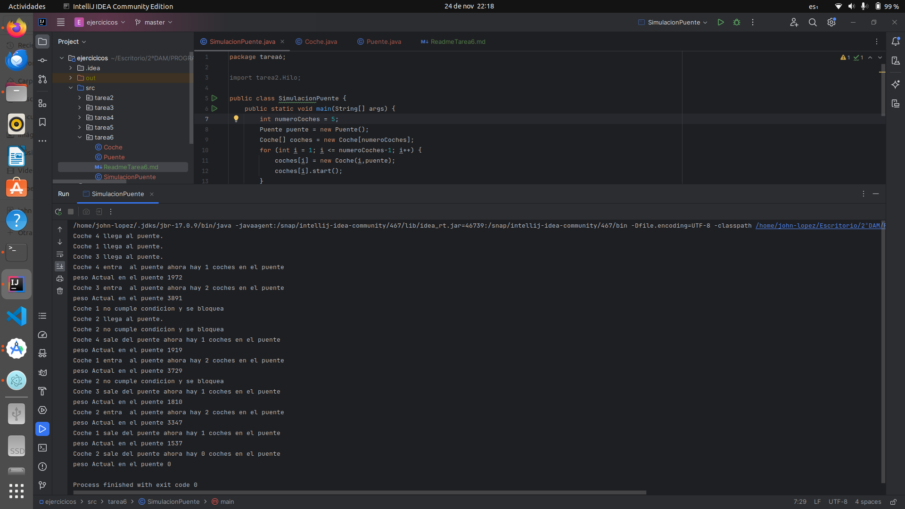

# Simulación de Paso de Coches por un Puente

## Descripción General

Este conjunto de clases simula el paso de coches por un puente con restricciones de capacidad y peso. La simulación
utiliza hilos para modelar coches que llegan al puente, esperan su turno y luego cruzan.

### Clases
1. SimulacionPuente
   La clase `SimulacionPuente` es la clase principal que inicia la simulación. Crea una instancia de la clase Puente y 
   un array de objetos Coche. Luego, inicia los hilos correspondientes a cada coche y espera a que todos los coches 
   completen su paso por el puente.

### Método main

```java
public class SimulacionPuente {
    public static void main(String[] args) {
        int numeroCoches = 10;
        Puente puente = new Puente();
        Coche[] coches = new Coche[numeroCoches];
        for (int i = 1; i <= numeroCoches-1; i++) {
            coches[i] = new Coche(i,puente);
            coches[i].start();
        }

        for (int i = 1; i <= numeroCoches-1; i++) {
            try {
                coches[i].join();
            } catch (InterruptedException e) {
                System.out.println(e.getMessage());
            }
        }
    }
}
```
Este método crea instancias de Puente y Coche, inicia los hilos de los coches y espera a que todos los coches hayan 
terminado su ejecución.

2. `Coche`
   La clase Coche extiende la clase Thread y representa un coche que intenta cruzar el puente. Cada coche tiene un 
   identificador único (id) y una referencia al puente (`Puente`).

### Constructor

```java
public class Coche extends Thread {
    private final int id;
    private final Puente puente;

    public Coche(int id, Puente puente) {
        this.id = id;
        this.puente = puente;
    }
}
```
El constructor asigna valores iniciales al identificador y al puente.

### `Método run`

```java
@Override
    public void run() {
        Random random = new Random();
        int peso = random.nextInt(1201) + 800;
        int tiempoLlegada = random.nextInt(2);
        int tiempoPaso = random.nextInt(5) ;

        try {
            sleep(tiempoLlegada * 1000);  // Convierte segundos a milisegundos
            System.out.println("Coche " + id + " llega al puente.");
            if (puente.sePermitePaso(peso,id)) {
                sleep(tiempoPaso * 1000);  // Convierte segundos a milisegundos
                puente.finalizarPaso(peso,id);
            } else {
                System.out.println("Coche " + id + " no puede cruzar en este momento.");
            }
        } catch (InterruptedException e) {
            System.out.println(e.getMessage());
        }
    }
}

```

El método run simula el proceso de llegada al puente, espera y cruza el puente si se permite.

3. `Puente`
   La clase Puente modela el puente con restricciones de capacidad y peso.

### Atributos

```java
public class Puente {
    private final int pesoMaximo = 5000;
    private final int capacidadMaxima = 3;
    private int pesoActual = 0;
    private int cochesEnPuente = 0;
}
```
Define los límites de peso y capacidad del puente, así como el peso y la cantidad de coches actuales.

### `Método sePermitePaso`

```java
public synchronized boolean sePermitePaso(int pesoCoche, int id) throws InterruptedException {
    while (cochesEnPuente == capacidadMaxima || pesoActual + pesoCoche > pesoMaximo) {
        System.out.printf("Coche %d no cumple condicion y se bloquea%n", id);
        wait();
    }
    cochesEnPuente++;
    System.out.printf("Coche %d entra al puente ahora hay %d coches en el puente%n", id, cochesEnPuente);
    pesoActual += pesoCoche;
    System.out.println("Peso Actual en el puente " + pesoActual);
    return true;
}

```
Este método verifica si un coche puede pasar el puente en función de la capacidad y el peso actuales.

### `Método finalizarPaso`

```java
public synchronized void finalizarPaso(int pesoCoche, int id) {
    cochesEnPuente--;
    System.out.printf("Coche %d sale del puente ahora hay %d coches en el puente%n", id, cochesEnPuente);
    pesoActual -= pesoCoche;
    System.out.println("Peso Actual en el puente " + pesoActual);
    notifyAll();
}
```
Este método se llama cuando un coche ha cruzado el puente y actualiza la cantidad y el peso actuales.

### Conclusión

Esta simulación representa de manera efectiva el paso de coches por un puente con restricciones de capacidad y peso. 
Los comentarios en el código proporcionan una guía adicional para entender el flujo del programa y la lógica detrás de 
cada decisión.

### Imagen de ejecución del programa:



[REPOSITORIO:]()